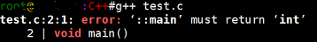
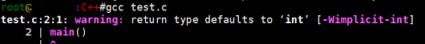
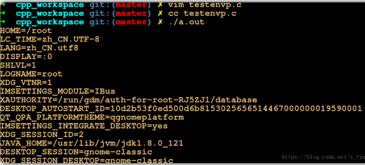

### main的返回值

`main`函数的返回值用于说明程序的退出状态。如果返回`0`，则代表程序正常退出。返回其它数字的含义则由系统决定。通常，返回非零代表程序异常退出。
#### void main（）
有一些书上的，都使用了`void main()` ，其实这是错误的。`C/C++ `中从来没有定义过`void main()` 。

`C++` 之父 `Bjarne Stroustrup` 在他的主页上的 `FAQ` 中明确地写着 `“The definition void main( ) { /* … */ } is not and never has been C++, nor has it even been C.”`这可能是因为 在 `C` 和 `C++` 中，不接收任何参数也不返回任何信息的函数原型为`“void foo(void);”`。

可能正是因为这个，所以很多人都误认为如果不需要程序返回值时可以把`main`函数定义成`void main(void)` 。然而这是错误的！`main` 函数的返回值应该定义为 `int` 类型，`C `和 `C++` 标准中都是这样规定的。

虽然在一些编译器中，`void main（）` 可以通过编译，但并非所有编译器都支持 `void main（）` ，因为标准中从来没有定义过 `void main` 。

`g++3.2` 中如果 `main` 函数的返回值不是` int` 类型，就根本通不过编译。而 `gcc3.2` 则会发出警告。所以，为了程序拥有很好的可移植性，一定要用 `int main （）`。测试如下：
```
#include <stdio.h>
void main()
{
    printf("Hello world");
    return;
}
```
运行结果：`g++ test.c`


#### main()

那既然`main`函数只有一种返回值类型，那么是不是可以不写？**规定：不明确标明返回值的，默认返回值为int，也就是说 main()等同于int main()，而不是等同于void main()**。

在`C99`中，标准要求编译器至少给 `main()` 这种用法来个警告，而在`c89中`这种写法是被允许的。但为了程序的规范性和可读性，还是应该明确的指出返回值的类型。测试代码：
```
#include <stdio.h>
main()
{
    printf("Hello world");
    return 0;
}
```
运行结果：


#### Ｃ和C++的标准

在 `C99` 标准中，只有以下两种定义方式是正确的：
```
int main( void ) 
int main( int argc, char *argv[] ) 
```
若不需要从命令行中获取参数，就使用`int main(void);`否则的话，就用`int main( int argc, char *argv[] )`。当然参数的传递还可以有其他的方式，在下一节中，会单独来讲。

`main` 函数的返回值类型必须是 `int` ，这样返回值才能传递给程序的调用者（如操作系统），等同于 `exit(0)`，来判断函数的执行结果。

`C++89`中定义了如下两种 `main` 函数的定义方式：
```
int main( ) 
int main( int argc, char *argv[] ) 
```
`int main()` 等同于 `C99` 中的 `int main( void );int main( int argc, char*argv[] )` 的用法也和`C99` 中定义的一样。同样，`main`函数的返回值类型也必须是`int`。
#### return 语句

如果 `main` 函数的最后没有写 `return` 语句的话，`C99` 和`C++89`都规定编译器要自动在生成的目标文件中加入`return 0`，表示程序正常退出。

不过，建议你最好在`main`函数的最后加上`return`语句，虽然没有这个必要，但这是一个好的习惯。在`linux`下我们可以使用`shell`命令：`echo $?` 查看函数的返回值。
```
#include <stdio.h>
int main()
{
    printf("Hello world");
}
```
运行结果：

同时，需要说明的是`return`的返回值会进行 类型转换，比如：若`return 1.2 ;`会将其强制转换为`1`，即真正的返回值是`1`，同理，`return ‘a’ ;`的话，真正的返回值就是`97`,；但是若`return “abc”；`便会报警告，因为无法进行隐式类型转换。

#### 测试main函数返回值的意义

前文说到，`main`函数如果返回`0`，则代表程序正常退出。通常，返回非零代表程序异常退出。在本文的最后，测试一下：　`test.c：`
```
#include <stdio.h>
int main()
{
    printf("c 语言");
    return 11.1; 
}
```
在终端执行如下：
```
➜  testSigpipe git:(master) ✗ vim test.c
➜  testSigpipe git:(master) ✗ gcc test.c
➜  testSigpipe git:(master) ✗ ./a.out && echo "hello world"  #&&与运算，前面为真，才会执行后边的
c 语言
```
可以看出，操作系统认为`main`函数执行失败，因为`main`函数的返回值是`11`
```
➜  testSigpipe git:(master) ✗ ./a.out 
➜  testSigpipe git:(master) ✗ echo $?
11
```
若将`main`函数中返回值该为`0`的话：
```c++
➜  testSigpipe git:(master) ✗ vim test.c
➜  testSigpipe git:(master) ✗ gcc test.c 
➜  testSigpipe git:(master) ✗ ./a.out && echo "hello world" #hello
c 语言
hello world
```
可以看出，正如我们所期望的一样，`main`函数返回`0`，代表函数正常退出，执行成功；返回非`0`，代表函数出先异常，执行失败。
### main函数传参

首先说明的是，可能有些人认为`main`函数是不可传入参数的，但是实际上这是错误的。`main`函数可以从命令行获取参数，从而提高代码的复用性。
#### 函数原形

为`main`函数传参时，可选的`main`函数原形为：
```
int main(int argc , char* argv[],char* envp[]);
```
**参数说明：**

    1.第一个参数argc表示的是传入参数的个数 。
    2.第二个参数char* argv[]，是字符串数组，用来存放指向的字符串参数的指针数组，每一个元素指向一个参数。各成员含义如下：
    argv[0]：指向程序运行的全路径名。
    argv[1]：指向执行程序名后的第一个字符串 ，表示真正传入的第一个参数。
    argv[2]：指向执行程序名后的第二个字符串 ，表示传入的第二个参数。
    ……argv[n]：指向执行程序名后的第n个字符串 ，表示传入的第n个参数。
    规定：argv[argc]为NULL ，表示参数的结尾。
    3.第三个参数char* envp[]，也是一个字符串数组，
    主要是保存这用户环境中的变量字符串，以NULL结束。
    envp[]的每一个元素都包含ENVVAR=value形式的字符串，
    其中ENVVAR为环境变量，value为其对应的值。
`envp`一旦传入，它就只是单纯的字符串数组而已，不会随着程序动态设置发生改变。可以使用`putenv`函数实时修改环境变量，也能使用`getenv`实时查看环境变量，但是`envp`本身不会发生改变；平时使用到的比较少。

==注意：`main`函数的参数`char* argv[]和char* envp[]`表示的是字符串数组，书写形式不止`char* argv[]`这一种，相应的`argv[][]`和`char** argv`均可==。
#### char* envp[]

写个小测试程序，测试`main`函数的第三个参数：
```c++
#include <stdio.h>
int main(int argc ,char* argv[] ,char* envp[])
{
    int i = 0;
    while(envp[i++])
    {
        printf("%s", envp[i]);
    }
    return 0;
}
```
运行结果：部分截图

`envp[]` 获得的信息等同于`Linux`下`env`命令的结果。

#### 常用版本

在使用`main`函数的带参版本的时，最常用的就是:`int main(int argc , char* argv[]);`变量名称`argc`和`argv`是常规的名称，当然也可以换成其他名称。

命令行执行的形式为：**可执行文件名 参数1 参数2 … … 参数n**。可执行文件名称和参数、参数之间均使用空格隔开。

**示例程序**
```c++
#include <stdio.h>

int main(int argc, char* argv[])
{
    int i;
    printf("Total %d arguments",argc);
    for(i = 0; i < argc; i++)
    {
        printf("Argument argv[%d]  = %s ",i, argv[i]);
    }
    return 0;
}
```
运行结果：
```c++
➜  cpp_workspace git:(master) ✗ vim testmain.c 
➜  cpp_workspace git:(master) ✗ gcc testmain.c 
➜  cpp_workspace git:(master) ✗ ./a.out 1 2 3    #./a.out为程序名 1为第一个参数 ， 2 为第二个参数， 3 为第三个参数
Total 4 arguments
Argument argv[0]  = ./a.out 
Argument argv[1]  = 1 
Argument argv[2]  = 2 
Argument argv[3]  = 3 
Argument argv[4]  = (null)    #默认argv[argc]为null
```
### main的执行顺序
#### 为什么说main（）是程序的入口

`linux`系统下程序的入口是`”_start”`，这个函数是`linux`系统库`（Glibc）`的一部分，当我们的程序和`Glibc`链接在一起形成最终的可执行文件的之后，这个函数就是程序执行初始化的入口函数。通过一个测试程序来说明：
```c++
#include <stdio.h>
int main()
{
    printf("Hello world");
    return 0;
}
```
编译：
```c++
gcc testmain.c -nostdlib 　　　　// -nostdlib (不链接标准库)
```
程序执行会引发错误：`/usr/bin/ld: warning: cannot find entry symbol _start;　`未找到这个符号

所以说：

```c
1.编译器缺省是找__start符号，而不是 main
2.__start 这个符号是程序的起始
3.main 是被标准库调用的一个符号
```
那么，这个`_start`和`main`函数有什么关系呢？下面我们来进行进一步探究。

`_start`函数的实现该入口是由`ld`链接器默认的链接脚本指定的，当然用户也可以通过参数进行设定。`_start`由汇编代码实现。大致用如下伪代码表示：
```c
void _start()
{
  %ebp = 0;
  int argc = pop from stack
  char ** argv = top of stack;
  __libc_start_main(main, argc, argv, __libc_csu_init, __linc_csu_fini,
  edx, top of stack);
}
```
对应的汇编代码如下：
```c
_start:
 xor ebp, ebp //清空ebp
 pop esi //保存argc，esi = argc
 mov esp, ecx //保存argv, ecx = argv

 push esp //参数7保存当前栈顶
 push edx //参数6
 push __libc_csu_fini//参数5
 push __libc_csu_init//参数4
 push ecx //参数3
 push esi //参数2
 push main//参数1
 call _libc_start_main

hlt
```
可以看出，在调用`_start`之前，装载器就会将用户的参数和环境变量压入栈中。
#### main函数运行之前的工作

从`_start`的实现可以看出，`main`函数执行之前还要做一系列的工作。主要就是初始化系统相关资源：
```c++
Some of the stuff that has to happen before main():

set up initial stack pointer 

initialize static and global data 

zero out uninitialized data 

run global constructors

Some of this comes with the runtime library's crt0.o file or its __start() function. Some of it you need to do yourself.

Crt0 is a synonym for the C runtime library.
```
- 1.设置栈指针
- 2.初始化`static`静态和`global`全局变量，即`data`段的内容
- 3.将未初始化部分的赋初值：数值型`short，int，long`等为`0`，`bool`为`FALSE`，指针为`NULL`，等等，即`.bss`段的内容
- 4.运行全局构造器，类似`c++`中全局构造函数
- 5.将`main`函数的参数，`argc，argv`等传递给`main`函数，然后才真正运行`main`函数
#### main之前运行的代码

下面，我们就来说说在`mian`函数执行之前到底会运行哪些代码：

    （1）全局对象的构造函数会在main 函数之前执行。
    （2）一些全局变量、对象和静态变量、对象的空间分配和赋初值就是在执行main函数之前，而main函数执行完后，还要去执行一些诸如释放空间、释放资源使用权等操作
    （3）进程启动后，要执行一些初始化代码（如设置环境变量等），然后跳转到main执行。全局对象的构造也在main之前。
    （4）通过关键字attribute，让一个函数在主函数之前运行，进行一些数据初始化、模块加载验证等。
**示例代码**

通过关键字attribute
```c++
#include <stdio.h>
__attribute__((constructor)) void before_main_to_run() 
{ 
    printf("Hi～,i am called before the main function!");
    printf("%s",__FUNCTION__); 
} 

__attribute__((destructor)) void after_main_to_run() 
{ 
    printf("%s",__FUNCTION__); 
    printf("Hi～,i am called after the main function!");
} 

int main( int argc, char ** argv ) 
{ 
    printf("i am main function, and i can get my name(%s) by this way.",__FUNCTION__); 
    return 0; 
}
```
全局变量的初始化
```c++
#include <iostream>
using namespace std;
inline int startup_1()
{
    cout<<"startup_1 run"<<endl;
    return 0;
}

int static no_use_variable_startup_1 = startup_1();

int main(int argc, const char * argv[]) 
{
    cout<<"this is main"<<endl;
    return 0;
}
```
在`main`函数运行之后还有其他函数可以执行，`main`函数执行完毕之后，**返回到入口函数，入口函数进行清理工作，包括全局变量析构、堆销毁、关闭I/O等，然后进行系统调用结束进程**。
#### main函数之后执行的函数
- 全局对象的析构函数会在`main`函数之后执行
- 用`atexit`注册的函数也会在`main`之后执行。

**atexit函数**
```c++
//原形:
int atexit(void (*func)(void)); 
```
**`atexit` 函数可以“注册”一个函数，使这个函数将在main函数正常终止时被调用，当程序异常终止时，通过它注册的函数并不会被调用**。

编译器必须至少允许程序员注册32个函数。如果注册成功，`atexit` 返回`0`，否则返回非零值，没有办法取消一个函数的注册。

在 `exit` 所执行的任何标准清理操作之前，被注册的函数按照与注册顺序相反的顺序被依次调用。每个被调用的函数不接受任何参数，并且返回类型是 `void`。被注册的函数不应该试图引用任何存储类别为 `auto` 或 `register` 的对象（例如通过指针），除非是它自己所定义的。

多次注册同一个函数将导致这个函数被多次调用。函数调用的最后的操作就是出栈过程。`main()`同样也是一个函数，在结束时，按出栈的顺序调用使用`atexit`函数注册的，所以说，函数**atexit是注册的函数和函数入栈出栈一样，是先进后出的，先注册的后执行**。通过`atexit`可以注册回调清理函数。可以在这些函数中加入一些清理工作，比如内存释放、关闭打开的文件、关闭`socket`描述符、释放锁等等。
```C++
#include<stdio.h>
#include<stdlib.h>
void fn0( void ), fn1( void ), fn2( void ), fn3( void ), fn4( void );

int main( void ){
  //注意使用atexit注册的函数的执行顺序：先注册的后执行
    atexit( fn0 );  
    atexit( fn1 );  
    atexit( fn2 );  
    atexit( fn3 );  
    atexit( fn4 );

    printf( "This is executed first." );
    printf("main will quit now!");
    return 0;
}

void fn0(){
    printf( "first register ，last call" );
}

void fn1({
    printf( "next." );
}

void fn2(){
    printf( "executed " );
}

void fn3(){
    printf( "is " );
}

void fn4()
{
    printf( "This " );
}
```