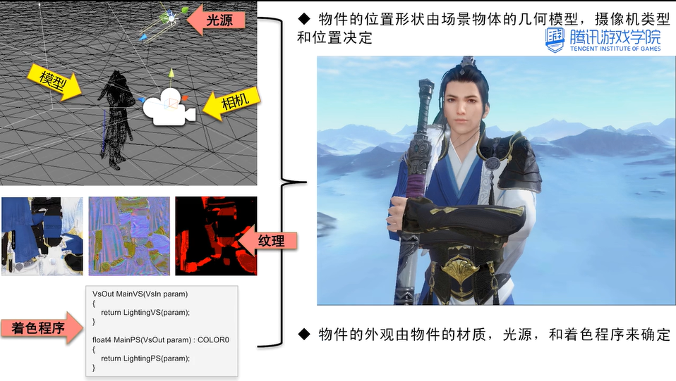

**渲染管线的任务是根据虚拟相机、模型对象、光源、着色程序和纹理等信息生成一张二维图像。**

**渲染管线分为以下三个阶段:**

- 应用程序做准备工作
- 几何处理场景物件的位置形状
- 光栅化表现物质的材质外观

**每个阶段可以细分成几个子阶段**

**开发者能够对应用程序阶段进行完全的控制，该阶段涉及到大量的运算，通常用多线程来提高性能**

**图元是用来组成三维实体的一组顶点，通过顶点流传给GPU使用，同时还需要一个索引流来表明哪两个顶点是相互连接的。相机通过三角形面的顶点排列顺序判断相机看到的三角形是正还是反(顺时针正，逆时针反)**

**游戏中的复杂世界是由图元构成的，许多光滑曲面物体是由三角形网格表现的，网格越多效果越好，下图中间位置低模的网格数量小于右边的高模，实时渲染游戏只能承受低模的开销，但有些算法可以让低模呈现出接近高模的品质。**

**用顶点声明说明传给GPU的顶点流的数据是如何分布的**

**几何阶段主要负责多边形操作和顶点操作**

**模型变化是将模型位置、法线等顶点信息，从模型的本地坐标变化到适合渲染计算的空间中。例如:光照计算在世界坐标下计算比较方便，如果为了实现一些特殊效果，可以把光照方向从世界空间变化到模型空间，视图变换是将摄像机放置在坐标系原点，Z轴指向相机前后方向，X轴指向左右，Y轴指向上下**

**着色(shader)是确定材质上的光照效果，着色过程是在对象上应用着色程序，模型顶点上的计算可以在几何阶段执行，另一部分逐像素在光栅化阶段执行，顶点着色的结果被发送到光栅化阶段，进行插图操作，逐顶点计算比逐像素计算快，所以某些计算放在哪一步要在效果和效率做平衡**

**投影变化是将模型从三维空间投射到二维空间的过程，将可视体变换到（-1，-1，-1）（1，1，1）的单位立方体内的过程，透视投影模拟人类感知物体的方式近大远小，透视投影的可视体是一个平衡椎体，正交投影的可视体是一个矩形**

**裁剪是对部分位于视体内部的图元进行裁剪操作，对图元和可视体相交部位添加顶点，生成新的图元**

**视口变化(屏幕映射)将之前步骤得到的坐标映射到对应的屏幕坐标系上**。

**绘制出整幅图像的过程叫做光栅化，光栅化阶段操作的是像素**

**三角形设置是为了三角形遍历做准备，需要计算三角形所覆盖的范围**

三角形遍历将进行逐像素检查操作，检查像素中心是否被三角形覆盖，如果覆盖就在该像素点处生成片段，每个像素片段的属性均由三角形的三个顶点的属性插值生成，这些属性可以包括片段的深度和来自几何阶段的逐顶点数据(纹理坐标，法线方向，颜色)

所有逐像素的计算在像素着色阶段进行，使用上一个步骤插值得来的顶点着色数据作为输入，输出结果是一个或多个颜色信息(纹理贴图操作在该阶段进行)

合并主要是合成当前存储在颜色缓冲器中的由之前像素阶段产生的颜色，每个像素的信息都存储在颜色缓冲器里，颜色缓冲器是一个二维矩阵和屏幕等大，每个像素包括红绿蓝三个颜色分量和一个表示透明值得α值，合并类似ps中的图层合并，合并还要处理物件间的遮挡，通过Z缓冲(深度缓冲器)来实现，Z缓冲和颜色缓冲器的形状大小一样，每个像素都存储着一个Z值，表示从相机到最近图元之间的距离，每次将一个图元绘制到相应像素里面的时候都需要计算像素位置处图元的Z值，并与同一像素处Z缓冲器里的内容进行比较，如果新计算出来的Z值比较小，说明该绘制的图元与相机的距离比原来最近的图元还要近，这样缓冲器里面的值，就应该由当前图元对应的Z值和颜色来进行更新，反之新图元被遮挡了，那缓冲器里面的值不变。除了颜色缓冲器，还要模板缓冲器(STENCIL BUFFER)，它通常是一个8位的掩码，用来控制颜色深度缓冲器的更新。模板缓冲是制作各种特殊效果和优化性能的强大工具

应用程序阶段是在CPU上执行的，任务是将渲染需要的所有数据传给GPU，几何阶段负责处理大部分多边形操作和顶点操作，分为五个阶段。

